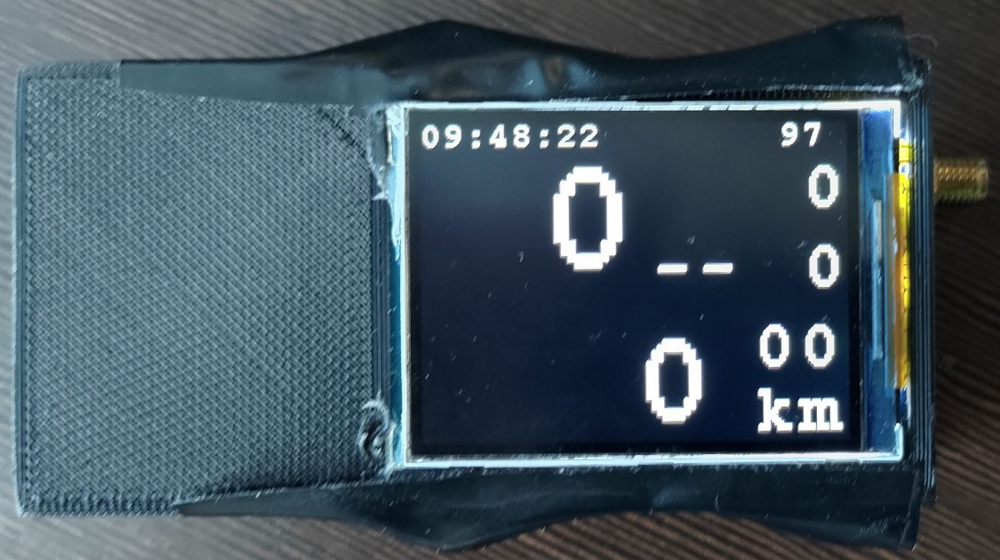
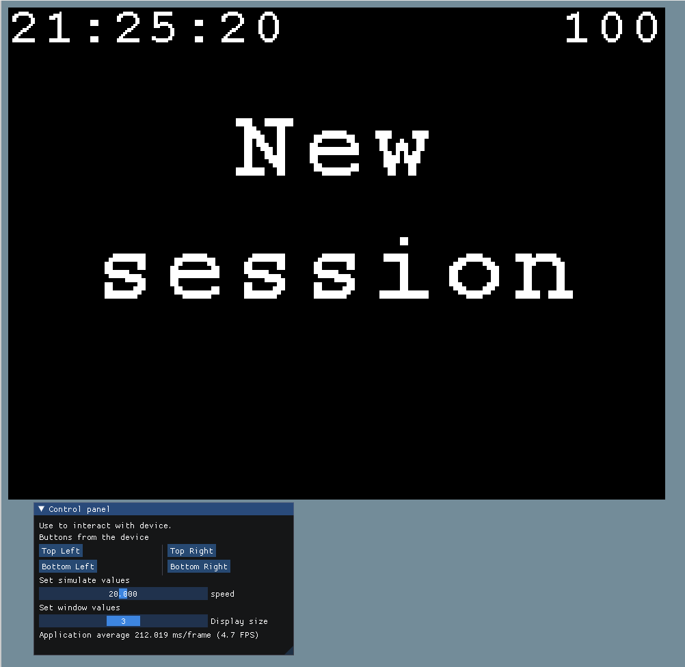

# Bike_computer

Bike computer based on pi pico.

Bicycle computer that collects basic data such as speed, cadence and many other functionalities.
This device stands out by measuring your current gear. The gear is measured by
the ratio of the rotation of the pedals to the rotation of the wheel.
Also contains velocity approximations for a decelerating bicycle. The speed approximation functionality has been tested and works correctly and the gear indication works satisfactorily.


## Measured Data
Measured and Displayed Data:

1. Speed:
   - Current speed [km/h]
   - Average session speed [km/h]
   - Maximum session speed [km/h]

2. Session Information:
   - Session duration [hh:mm:ss]
   - Distance traveled in session [km]

3. Cycling Metrics:
   - Cadence [rpm]
   - Current gear
   - Gear suggestion (upshift, downshift, or maintain current gear)

4. Altitude and Location:
   - Altitude relative to starting point [m]
   - Current GPS coordinates

5. Environmental Conditions:
   - Temperature [°C]
   - Gradient [%]

6. Time and Total Metrics:
   - Current date and time [yyyy.mm.dd,hh:mm:ss]
   - Total distance traveled [km]
   - Total driving time [h]

##


# Build
```sh
$ make
```
For more info about building parameters
```sh
$ make H=1
```

# Emulator
There is working emulator to run it on normal computer build with [ImGui](https://github.com/ocornut/imgui) with use of SDL2.

```sh
$ make
$ ./build/tests/host/pico_main
```

# Tests
Tests build with my custom test framework that make it possible to run it on rp2040 hw. [pico_test](https://github.com/Mendiax/pico_tests)
